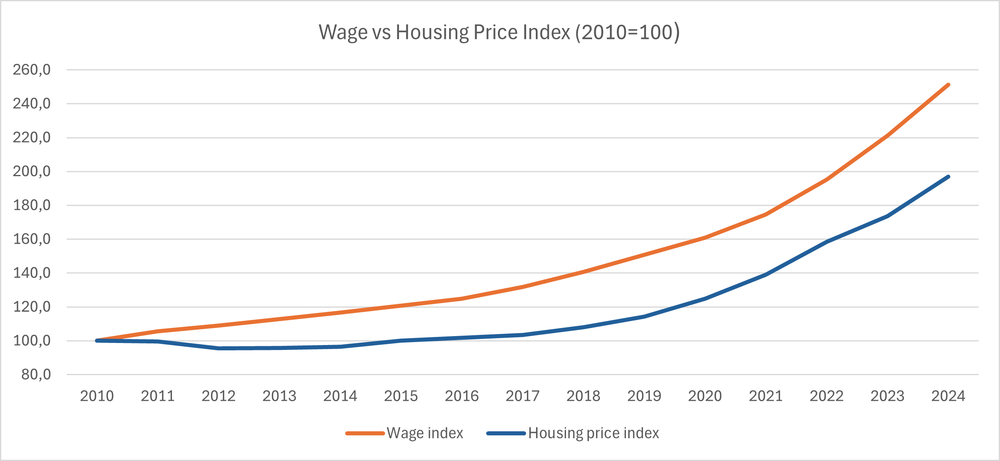
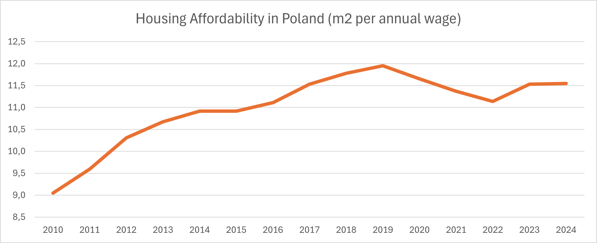
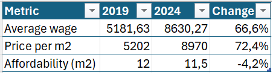
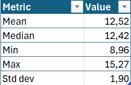
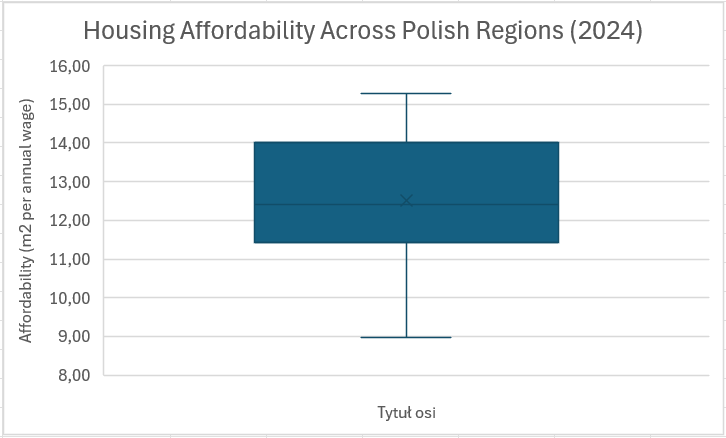
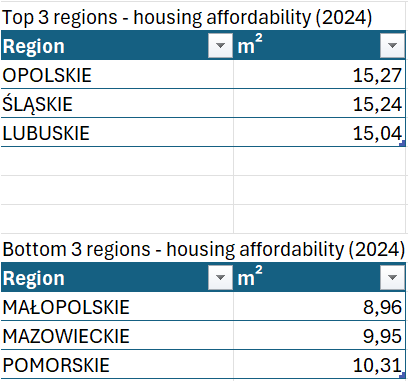
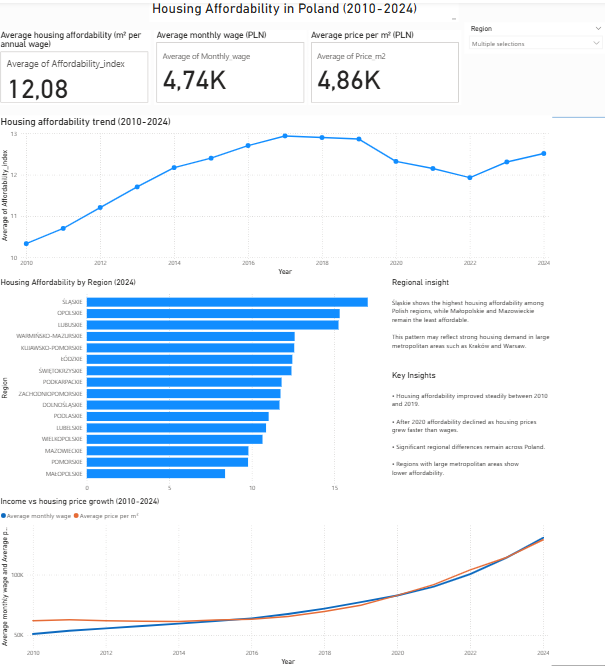

# Housing Affordability in Poland (2010-2024)

Analysis of housing affordability trends in Poland based 
on wage and housing price data from Statistics Poland (GUS).

---

## 1. Business Goal
The goal of this project is to analyze how housing prices and wages changed in Poland between 2010 and 2024.

The main question is:
Did housing prices grow faster than wages?

This analysis helps understand how housing affordability changed over time and supports strategic decisions for property developers.

---

## 2. Data & Methodology

Data source:
- Statistics Poland (GUS) - average monthly gross wages in Poland (2010–2024)
- Statistics Poland (GUS) - average transaction prices per m² (2010–2024)

Steps:
1. Cleaned and structured raw data in Excel.
2. Created wage index and housing price index (2010 = 100 as base year).
3. Calculated housing affordability:
   Affordability = (monthly wage × 12) / price per m²
4. Visualized trends using line charts in Excel and Pwer BI

---
## 3. Research Question 1 – Market Trend
Did housing prices increase faster than average wages in Poland between 2010 and 2024?

This section analyzes national housing market trends between 2010 and 2024.
To compare long-term growth, wage and housing price indices were created
(2010 = 100 as base year).

Between 2010 and 2024, wages increased 
from index 100 to 251, while housing 
prices increased from 100 to 197.

In the long term, wages grew faster 
than housing prices.

However, after 2020, housing prices 
accelerated significantly, which 
temporarily reduced housing affordability.

Housing affordability improved 
steadily between 2010 and 2019,
reaching its peak in 2019 (12 m² per 
annual wage).

After 2020, affordability declined due 
to rapid housing price growth.

By 2024, affordability stabilized at 
approximately 11.5 m² per annual wage.

---
### Key Findings

- Between 2010 and 2024, wages grew
  faster than housing prices in the long term.
- Housing affordability improved
  steadily until 2019, reaching its peak
  of 12 m² per annual wage.
- After 2020, rapid housing price
  growth temporarily reduced affordability.
- By 2024, affordability stabilized at
  approximately 11.5 m² per annual wage.

---
## 4. Turning Point After 2019

After the long period of improving 
housing affordability, a noticeable 
shift occurred after 2019.
To better understand this change,
we compare wages, housing prices,
and affordability between 2019 and 2024.

Between 2019 and 2024, housing prices 
increased faster than wages in Poland.

Average wages grew by 66.6%, while the 
average price per square meter 
increased by 72.4%.

As a result, housing affordability slightly decreased. 
The affordability indicator declined from 12.0 m² per 
annual wage in 2019 to 11.5 m² in 2024.

This period marks a turning point, when housing 
price growth began to outpace wage growth.

---
## 5. Regional Analysis (2024)

To better understand regional 
differences in housing affordability, 
the analysis compares the affordability 
index across Polish regions in 2024.

The affordability index represents how many 
square meters of housing can be purchased 
with the average annual wage in each region.

### Descriptive statistics - housing affordability across regions (2024)

The average housing affordability 
across regions in 2024 was 12.52 m² 
per annual wage.

However, the range between the least 
and most affordable regions is 
significant, varying from 8.96 m² to 15.27 m².

This suggests noticeable regional 
disparities in housing affordability 
across Poland.

### Distribution of housing affordability across regions 

Boxplot - housing affordability across Polish regions (2024)

The boxplot illustrates the distribution 
of housing affordability across regions.

The median affordability is 12.42 m² 
per annual wage, meaning that half 
of the regions fall above this level 
and half below it.

Most regions fall within a relatively 
narrow range, but a few regions 
show significantly higher or lower 
affordability levels.

### Regional ranking (2024)

The regional ranking highlights clear 
differences in housing affordability 
across regions.

Opolskie, Śląskie, and Lubuskie show 
the highest affordability levels, 
exceeding 15 m² per annual wage.

In contrast, Małopolskie, Mazowieckie, 
and Pomorskie have the lowest affordability levels, 
all below approximately 11 m² per annual wage.

---
### Interpretation 

Lower housing affordability in regions
such as Mazowieckie and Małopolskie may 
be influenced by strong housing demand 
in major metropolitan areas such as Warsaw and Kraków.

In contrast, regions with smaller urban 
centers tend to exhibit higher housing 
affordability.

This pattern suggests that regional 
housing affordability in Poland is 
strongly influenced by the presence 
of large metropolitan housing markets.

The similarity between the mean and
median values also suggest that 
housing affordability across regions 
is relatively evenly distributed,
without extreme outliers.

---
### Power BI Dashboard

The analysis was also visualized in 
an interactive Power BI dashboard.

The dashboard presents key indicators 
of housing affordability in Poland, including:

- Average housing affordability index
- Average monthly wage
- Average price per square meter
- Housing affordability trend (2010–2024)
- Regional housing affordability ranking
- Comparison of wage growth and housing price growth

The dashboard allows users to explore regional 
differences using an interactive region filter.

---
### Tools used

- Excel (data cleaning, calculations, descriptive statistics)
- Power BI (data visualization and dashboard)
- GitHub (project documentation and presentation)

---
### Project summary

This project analyzes housing affordability
in Poland between 2010 and 2024 using wage 
and housing price data.

The results show that housing affordability 
improved until around 2019 but began to decline 
after 2020 as housing prices increased faster 
than wages.

Regional analysis reveals significant differences 
across Poland, with regions containing major 
metropolitan areas generally showing lower 
affordability.

The analysis demonstrates how data analysis 
and visualization tools can be used to identify 
economic trends and regional disparities 
in the housing market.
